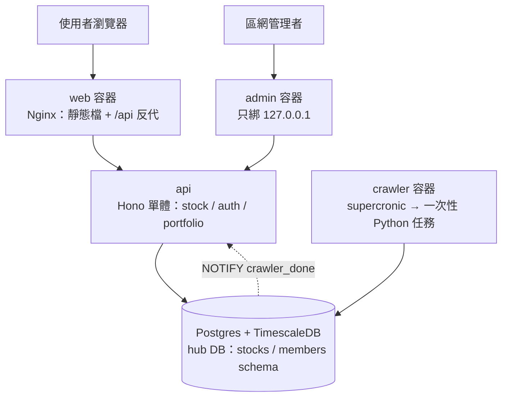
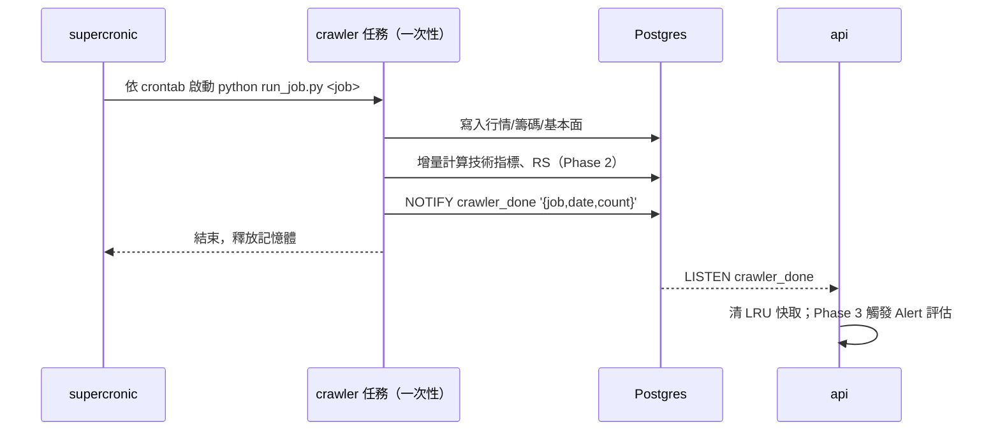
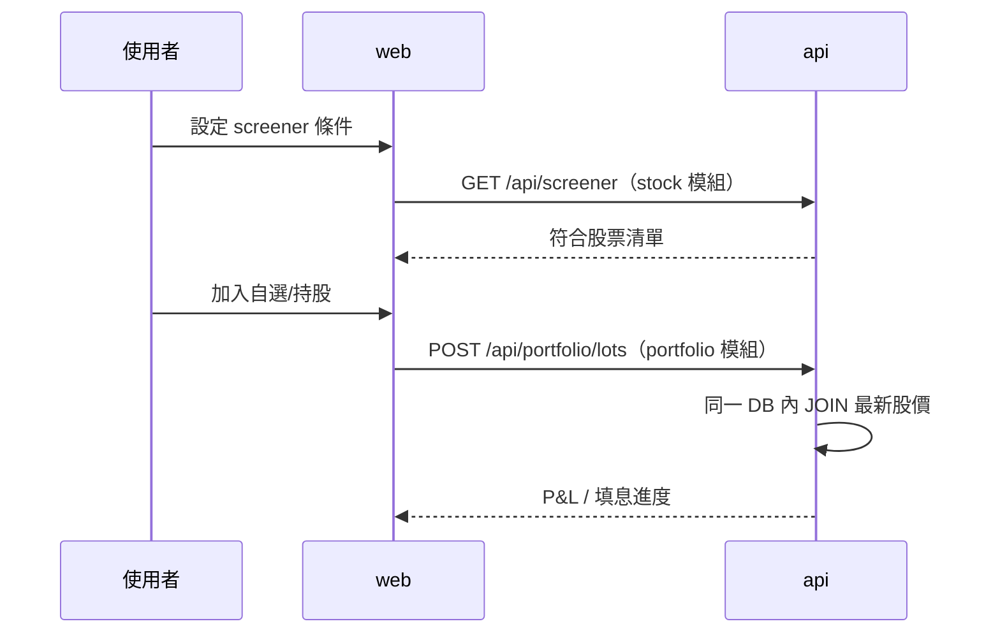

# tw-stock-hub 專案架構文件

Sep 23, 2026 · @Someone（2026-09-23 grilling 後修訂）

tw-stock-hub 是合併 taiwan-stock-platform（全市場行情/籌碼/基本面資料引擎）與股息站 Dividend-Information-Hub（個人存股追蹤工具）後重寫的新專案，目標是讓全市場選股與個人持股管理共用同一套資料與帳號系統。

## 專案介紹

**緣起**：原本有兩個獨立 repo——`taiwan-stock-platform`（全市場行情、三大法人、融資融券、基本面、選股篩選器）與 `Dividend-Information-Hub`（個人存股批次成本、填息追蹤、DRIP、配息行事曆）。兩者各自維護一套 TWSE/TPEx 爬蟲、各自的登入系統，資料互不相通。

**核心價值**：使用者登入一次，就能在同一套系統裡「用全市場資料篩股」＋「把篩到的股票直接加入自選/持股追蹤」，不用在兩個網站間切換。

**目標使用者**：自己＋少數親友（邀請制，`ALLOWED_EMAILS` allowlist，不開放註冊）。台股 TWSE 上市 + TPEx 上櫃存股投資人。

**三個篩選面向**：

- 技術面：RSI、KD、MACD、均線、布林通道，每日盤後增量預算
- 基本面：本益比、毛利率、營收年增率、連續配息年數、股權集中度趨勢
- 市場趨勢：個股/類股相對大盤強弱度（RS）、均線多頭排列

## 分階段

總目標全做完，分三階段交付：

| 階段 | 內容 |
| --- | --- |
| Phase 1 | Turborepo 骨架、Hono 單體（stock/auth/portfolio 模組）、Drizzle、Google OAuth + allowlist、搬 web 現用的行情/法人/融資 API、portfolio 核心（HoldingLot、賣出、P&L、除息日持股股利、自選分組）、supercronic 一次性爬蟲 + `pending_jobs`、TimescaleDB 壓縮、web `/portfolio`（shadcn-vue）、admin 沿用 |
| Phase 2 | 技術指標（增量）、RS、screener 三面向篩選 |
| Phase 3 | 盤後 Alert + 通知中心、Telegram、backtest、score、news、分點（含 on-demand 分點爬取） |

## 系統架構圖

- 一個 Postgres server、一個 database（`hub`）、兩個 schema：`stocks`（全市場時序）與 `members`（會員/持股/自選）。
- **沒有 Redis**：爬蟲完成通知用 Postgres `LISTEN/NOTIFY`，回應快取用程序內 LRU。
- 目前**只在本機跑**。上線前必做：所有 `/api/*` 要求 JWT、Cloudflare Tunnel、admin 限區網或 Cloudflare Access。

## 服務模組說明

| 服務 | 技術 | 職責 |
| --- | --- | --- |
| api | Node 22 + Hono + Drizzle（postgres.js） | 單一 process，三個模組：`stock`（全市場公開資料 API）、`auth`（Google OAuth、簽 JWT、allowlist）、`portfolio`（自選分組、HoldingLot、賣出、P&L、股利；Phase 3 加 Alert/通知） |
| crawler | Python + supercronic | TWSE/TPEx OpenAPI + FinMind 爬蟲、技術指標/RS 增量計算、填息追蹤。每個任務一次性執行完即結束 |
| web | Vue 3 + Pinia + shadcn-vue，Nginx 服務 | 市場主站 + `/portfolio` 分頁；Nginx 同時反代 `/api` |
| admin | Vue 3，Nginx 服務 | 爬蟲監控、資料健康檢查、手動觸發（寫 `pending_jobs`） |
| db | timescale/timescaledb（pg17） | `stocks` + `members` schema |

模組邊界：`stock`/`auth`/`portfolio` 之間只透過各模組 `index.ts` 匯出的函式互相呼叫，不 import 對方內部檔案。

## 資料流程圖

**盤後批次流程**：

**手動觸發爬蟲**：admin → api 寫入 `stocks.pending_jobs` → supercronic 每分鐘跑 `run_job.py --pending` 撿起執行（最多延遲 1 分鐘，無常駐 listener）。

**使用者選股＋追蹤流程**：

**警示通知流程**（Phase 3）：只做盤後。api 收到 `crawler_done`（行情、填息任務）後評估 `alert_rules`，成立寫入 `notifications`；通道 `inApp` + Telegram，不做 email。盤中警示日後需要時再接 TWSE MIS（可用 twstock.realtime）。

## 資料來源

| 來源 | 用途 |
| --- | --- |
| TWSE OpenAPI | 上市行情、財報、月營收、股利、估值 |
| TPEx OpenAPI | 上櫃對應資料（上市 OpenAPI 不含上櫃，必須另接） |
| FinMind | 補歷史與官方缺欄位 |
| MOPS | 只用於新聞公告，不抓財報 |

不採用：FinLab（免費版延遲 2 個月、授權限個人研究、pandas 寬表吃記憶體）、twstock（無財報，逐檔逐月抓太慢）、Goodinfo 類網站（反爬、條款灰色）。

## 資料庫設計

| Schema | 管理方式 | 主要資料表 |
| --- | --- | --- |
| stocks | `db/init/*.sql`（crawler 為寫入方） | 既有：行情、三大法人、融資融券、分點、基本面、股權分散、ETF；新增：`pending_jobs`、`technical_indicators`（Phase 2）、`market_strength`（Phase 2） |
| members | Drizzle migration（api 為擁有者） | `users`、`watchlist_groups`、`watchlists`、`holding_lots`、`holdings`（彙總）、`sell_transactions`；Phase 3：`alert_rules`、`notifications` |

- 所有 hypertable 完整保存歷史，超過 30 天的 chunk 自動壓縮（news 維持 180 天 retention）。
- DB 角色分離：`crawler` 角色只能寫 `stocks`；`api` 角色讀 `stocks`、讀寫 `members`。
- `holdings` 彙總表由 `holding_lots` 與 `sell_transactions` 在同一個 transaction 內重算，不是獨立資料源。
- **賣出**：加權平均成本扣減，寫入 `sell_transactions` 保留已實現損益。
- **股利**：以除息日當天持有股數（該日前買入總股數 − 賣出總股數）計算，不依附特定 lot。
- P&L 需處理「無最新股價」的持股，加總時排除無股價項目。
- 技術指標增量計算：每檔讀最近約 250 交易日，只寫當天；全量重算只在首次回補或公式變更時。

## 驗證與安全

- Google OAuth 登入後比對 `ALLOWED_EMAILS`，不在名單內拒絕。
- JWT 放 `httpOnly` + `Secure` + `SameSite=Lax` cookie；寫入類 API 經 `hono/csrf` 檢查 `Origin`。
- JWT 由 api 內共用 middleware 本地驗證，無跨服務呼叫。
- admin 沿用 Nginx 伺服器端注入 `X-Admin-Key`，admin 容器只綁 `127.0.0.1`。

## 部署與備份

**自架環境**：個人電腦 Docker Compose，記憶體優先。

- 所有 container 設 `mem_limit`。
- api 用正式 build（`node dist/index.js`）+ `--max-old-space-size`，不在容器跑 watch 模式。
- crawler 閒置時只剩 supercronic（約 10MB），任務結束即釋放記憶體。

**備份策略**：

| 對象 | 頻率 | 存放方式 |
| --- | --- | --- |
| members schema（爬不回來） | 每日 | `pg_dump -n members` → `age` 加密 → commit 到 **private** repo；金鑰存密碼管理器 |
| stocks schema（可重建） | 不備份 | 用爬蟲回填重建 |

## 關鍵架構決策紀錄

| # | 決策點 | 結論 |
| --- | --- | --- |
| 1 | 整合策略 | 開全新第三個 repo 重寫 |
| 2 | 技術骨架 | Turborepo + TimescaleDB + Python 爬蟲沿用；後端改 Hono |
| 3 | Auth | Google OAuth + JWT（cookie），`ALLOWED_EMAILS` allowlist |
| 4 | Portfolio 資料位置 | `members` schema |
| 5 | 資料同步 | 棄用股息站 sync，統一由 crawler 寫入 |
| 6 | 技術指標 | 每日盤後增量預算，存完整歷史 |
| 7 | 基本面篩選 | screener 加入 PE/毛利率/營收YoY/配息年數/股權集中度 |
| 8 | 市場趨勢篩選 | RS 相對強弱 + 均線多頭排列 |
| 9 | 前端整合 | 合併進 web 的 `/portfolio` 分頁 |
| 10 | 財報資料源 | ~~新介接 MOPS~~ → TWSE + TPEx OpenAPI 為主、FinMind 補 |
| 11 | 後端架構 | ~~三個 NestJS 服務~~ → Hono 模組化單體（Node 22） |
| 12 | 既有資料遷移 | 不需要，手動輸入 |
| 13 | Watchlist | ~~auth-service~~ → portfolio 模組，含分組 |
| 14 | Alert/通知 | 盤後、`crawler_done` 事件觸發；inApp + Telegram（Phase 3）。股息站僅有資料表結構可參考 |
| 15 | Container 資源上限 | 全部加上 mem_limit |
| 16 | UI 庫 | shadcn-vue |
| 17 | 備份 | members 每日加密進 private git；stocks 不備份 |
| 18 | DB 結構 | 一個 database、`stocks`/`members` 兩個 schema |
| 19 | ORM | Drizzle（+ drizzle-zod、@hono/zod-openapi） |
| 20 | Redis | 移除，改 `LISTEN/NOTIFY` + 程序內 LRU |
| 21 | 爬蟲執行 | supercronic + 一次性任務；手動觸發走 `pending_jobs` |
| 22 | 賣出 | 加權平均成本 + `sell_transactions` 已實現損益 |
| 23 | 股利計算 | 除息日持有股數 |
| 24 | 時序壓縮 | 所有 hypertable 30 天後壓縮 |
| 25 | 使用範圍/曝露 | 自用 + 親友邀請制；目前只在本機，上線前補 API 全面驗證與 Tunnel |
| 26 | 技術指標與 RS 實作 | crawler `analytics/`（technical、strength）一次性任務，排在行情之後；公式與前端圖表共用同一套（MA/RSI/KD/MACD）。RS＝20/60/120/250 日加權報酬的全市場百分位，歷史不足 250 日不給分 |
| 27 | 選股器 | 單一 `POST /screener`，一次 SQL；hypertable 帶常數日期避免鎖滿 chunk；法人／成交量單位統一為張 |
| 28 | 歷史回補 | 逐日資料（行情、籌碼、大盤、估值）走 TWSE/TPEx 依日期端點；多年基本面（股利含除息日、財報、營收）只能逐檔走 FinMind，依成交值排序、可續跑 |
